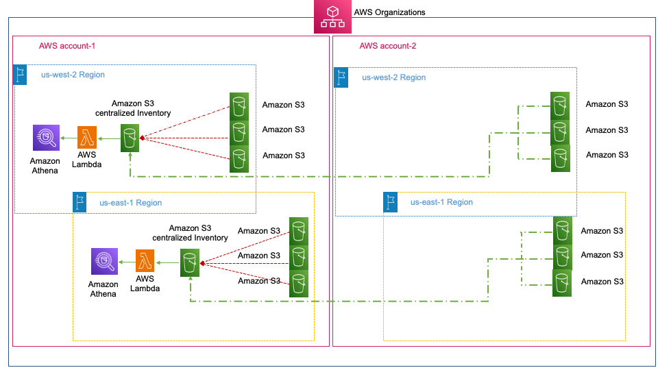

Amazon S3 Inventory is used to help manage your storage. For example, you can use it to audit and report on the replication and encryption status of your objects for business, compliance, and regulatory needs. You can also simplify and speed up business workflows and big data jobs by using Amazon S3 Inventory, which provides a scheduled alternative to the Amazon S3 synchronous List API operations. Amazon S3 Inventory does not use the List API operations to audit your objects and does not affect the request rate of your bucket.
Amazon S3 Inventory provides comma-separated values (CSV), Apache optimized row columnar (ORC) or Apache Parquet output files that list your objects and their corresponding metadata on a daily or weekly basis for an S3 bucket or objects with a shared prefix (that is, objects that have names that begin with a common string). If you set up a weekly inventory, a report is generated every Sunday (UTC time zone) after the initial report.This configuration requires one Athena table and one associated query per bucket. Customers that store data in multiple buckets across different accounts and AWS Regions must complete the following tasks for each bucket:
 1.	Enable Amazon S3 Inventory configuration at the bucket or prefix level across accounts and AWS Regions. This must be completed for all existing buckets, and all subsequently created buckets.
 2.	Move and structure the data from multiple accounts and AWS Regions into one bucket.

To simplify and automate the above tasks, customers can leverages AWS CloudFormation, AWS Lambda, and Python scripts provided in the repository. It also extends the visibility of the objects by organizing Amazon S3 Inventory reports in a partitioned Athena table for performance improvement and cost reduction on multiple accounts and across AWS Regions. 

**Architecture Diagram**

**Walkthrough** 

The solution is deployed in three steps: 

1.	Configure and centralize Amazon S3 Inventory across AWS Regions and across AWS accounts.
2.	Automate query setup across AWS Regions in the delegated administrator account.
3.	Query centralized Amazon S3 Inventory using Athena.

The following steps walk you through implementing the solution.

If you set a member account to collect Org-level S3 inventories in your Organization, please nominate that account as the destination account (other than Management Account) for managing inventories for all other accounts that act as source accounts.
 
**PREREQUISITE :**

• Register destination account as the delegate administrator account

• Python3.7+ installed on your machine, or on EC2 instance from your destination account, or Cloud9 

1. Clone the registry containing python scripts. Theses scripts require several Python libraries, which are listed in the requirements.txt file.

2. Run the requirement.txt file from the folder where you have downloaded all files.
**pip3 install -r requirements.txt**
 
NOTE: If the user has an administration access, you can skip step#3.

3. From the destination account, run py.exe .\createAttachPolicyToDestAcct.py to add IAM policy – “S3InvDestAccountPolicy” to IAM user’s profile to perform S3 service operational activities such as create a bucket, put bucket policy and others. 

Note: Please ensure that you have an appropriate AWS destination account credentials/role set on the machine, EC2 Instance or Cloud9 instance before executing the codes. 

4. If the destination account is not set as delegate administrator, register the destination account (other than the Management Account ) with delegated administrator permissions to create and manage stack sets with service-managed permissions for the organization. 

5. Create a CloudFormation stacksets from the delegated member account using script <<OrgS3InvSourceAccountPolicy.json>> or <<<<OrgS3InvSourceAccountPolicy.yaml>> to create IAM role, allowing the destination account to assume role and create S3 Inventories.

6. On the Specify stack details page, type a stack name in the Stack name and StackSet Description. Under Parameters, enter s3InventoryUser(your delegated admin user) and DelegatedAccountID.

7. Ensure “OrgS3role” role has the corresponding “OrgS3role_policy” policy with a trust relationship with the destination account and IAM user (if provided) in each source account.

8. From the destination account, you can run py.exe .\ orgS3Inventory.py to create a centralized S3 inventory bucket per region in the destination account to record inventories from all source accounts and buckets. Format of the destination bucket is “s3inventory-region-destinationaccountId”

9. Finally, execute a CloudFormation stack - S3Inventory.yaml from the destination account. This stack will create two lambda functions –
    
     i.	“lambda-function-inventory” which triggers when a new object is added to the destination S3 bucket. The function creates an Athena           table “Inventory” if it does not exist along with two partitions – “bucketname” and ‘dt”.
   
     ii.	Another lambda function is to set Event types of “s3:ObjectCreated:*” for the destination bucket.
   
**Note:** Please ensure that you've followed the principle of least privileges for the lambda function execution roles. 
   
11. Navigate to AWS Athena console/API to run analytics on the storage inventory from the table - "inventory" that is created per region.
